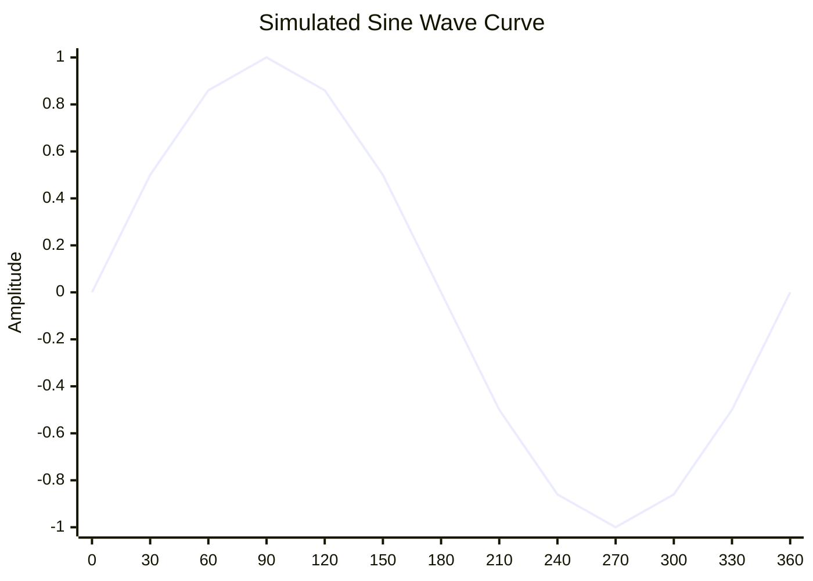

```mermaid
xychart-beta
    title "Simulated Sine Wave Curve"
    x-axis [0, 30, 60, 90, 120, 150, 180, 210, 240, 270, 300, 330, 360]
    y-axis "Amplitude" -1 --> 1
    line [0, 0.5, 0.86, 1, 0.86, 0.5, 0, -0.5, -0.86, -1, -0.86, -0.5, 0]
```