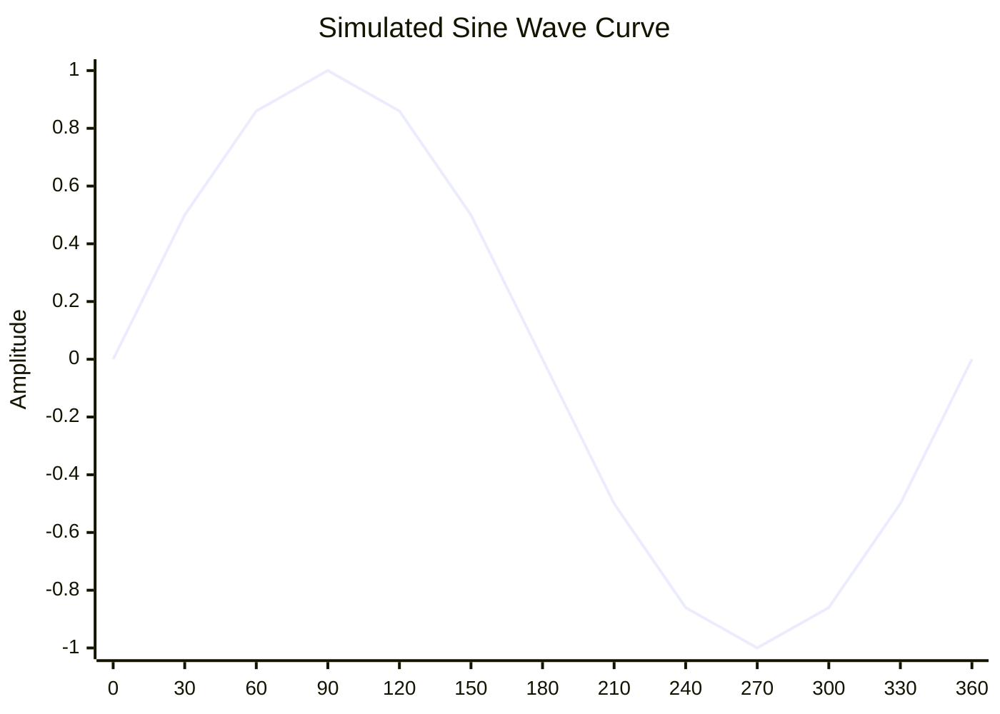
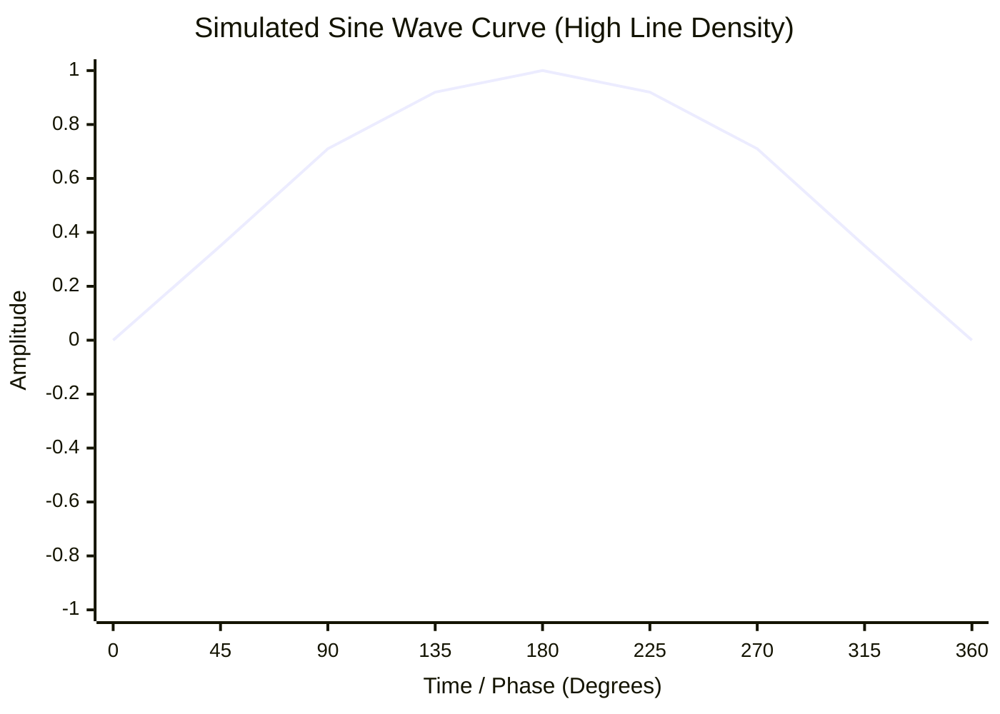
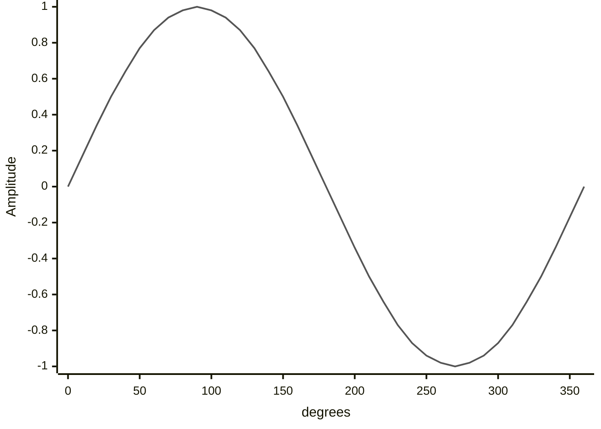

```mermaid
xychart-beta
    title "Simulated Sine Wave Curve"
    x-axis [0, 30, 60, 90, 120, 150, 180, 210, 240, 270, 300, 330, 360]
    y-axis "Amplitude" -1 --> 1
    line [0, 0.5, 0.86, 1, 0.86, 0.5, 0, -0.5, -0.86, -1, -0.86, -0.5, 0]
```

```mermaid
xychart-beta
    title "Simulated Sine Wave Curve (High Line Density)"
    x-axis "Time / Phase (Degrees)" [0, 45, 90, 135, 180, 225, 270, 315, 360]
    y-axis "Amplitude" -1 --> 1
    line [0, 0.35, 0.71, 0.92, 1, 0.92, 0.71, 0.35, 0, -0.35, -0.71, -0.92, -1, -0.92, -0.71, -0.35, 0]
```

```mermaid
%%{init: { 'themeVariables': { 'xyChart': { 'plotColorPalette': '#555555, #ff0000' } } } }%%
xychart-beta
    x-axis "degrees" 0 --> 360 
    y-axis "Amplitude" -1 --> 1
    line [0, 0.17, 0.34, 0.5, 0.64, 0.77, 0.87, 0.94, 0.98, 1.0, 0.98, 0.94, 0.87, 0.77, 0.64, 0.5, 0.34, 0.17, 0.0, -0.17, -0.34, -0.5, -0.64, -0.77, -0.87, -0.94, -0.98, -1.0, -0.98, -0.94, -0.87, -0.77, -0.64, -0.5, -0.34, -0.17, 0]
```

